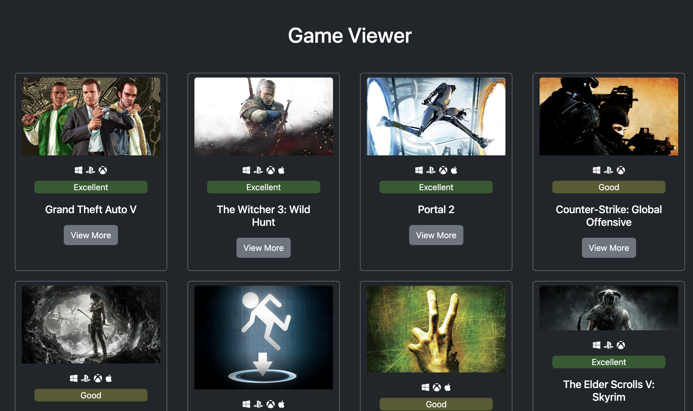

# game-viewer
A website that lists video-games. We can traverse the site, see games, watch screenshots, trailers and playable platforms. 
The website was made with HTML5 Boilerplate template.    

### Dependencies    
* It uses RAWG.io Web service to fetch video game data.  
* Bootstrap  
* RequireJS 
* fontawesome 

#### Screenhot:
</img>
